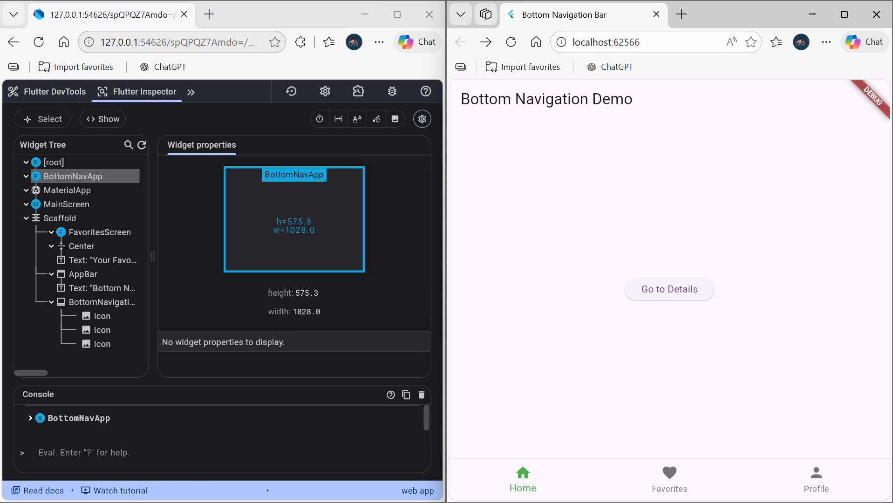
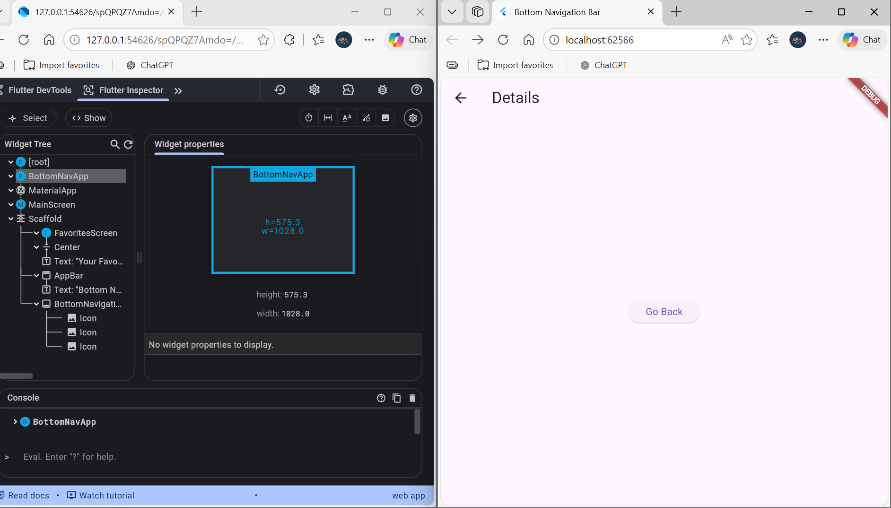
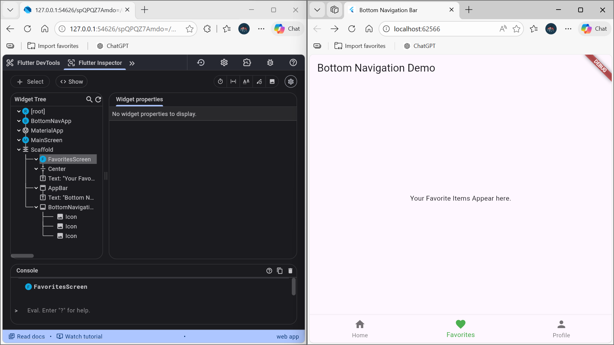
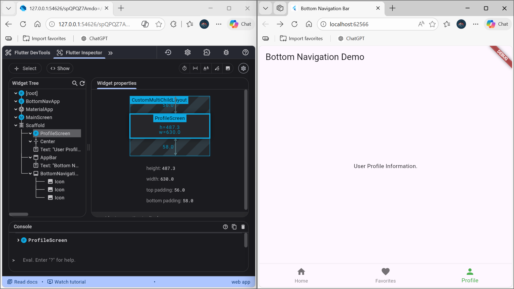
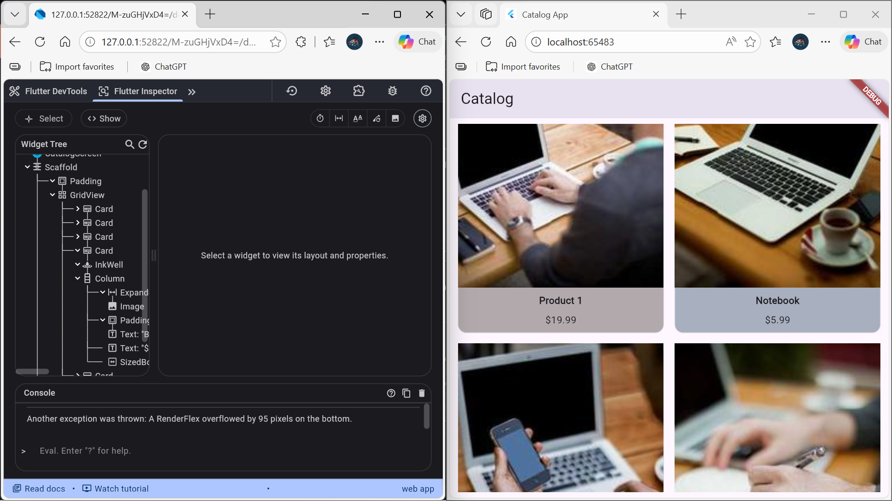
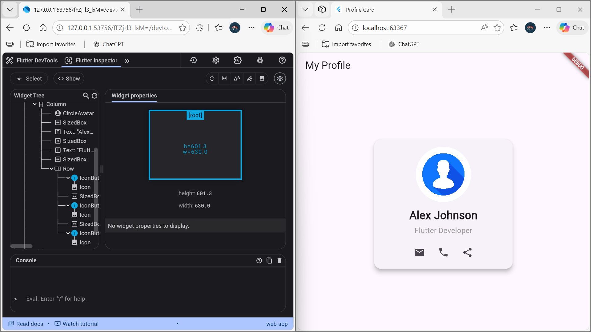
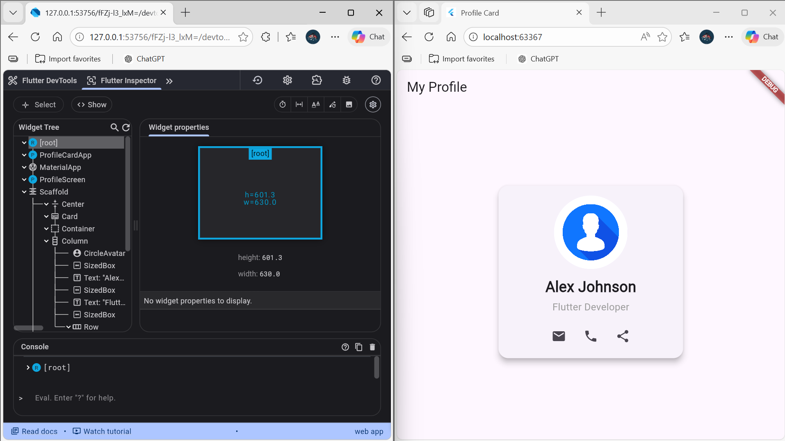
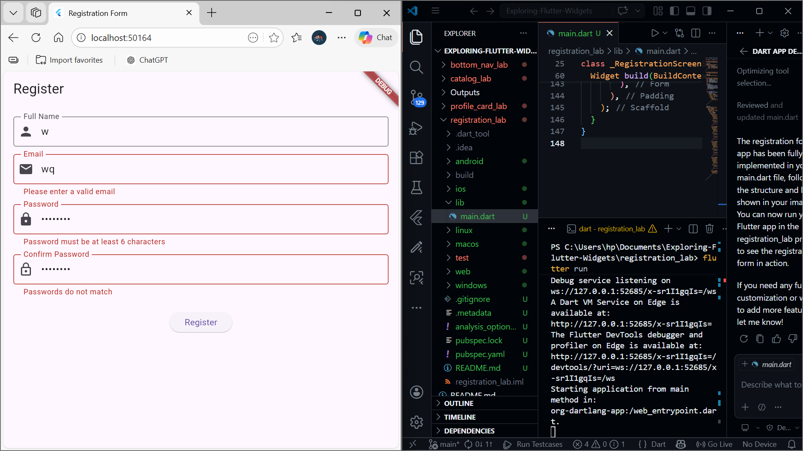
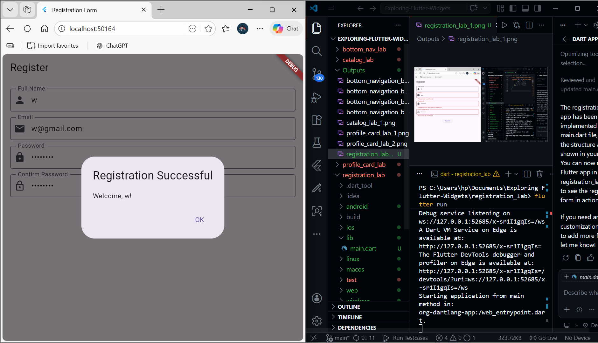

# Exploring-Flutter-Widgets

This repository contains hands-on labs and mini-projects to help you explore and master Flutter widgets. Each lab demonstrates a specific Flutter concept or UI pattern.

---

## Projects Overview

### 1. bottom_nav_lab
A Flutter app demonstrating the use of a Bottom Navigation Bar to switch between different screens (Home, Favorites, Profile). Includes navigation to a details page from Home.

**Features:**
- BottomNavigationBar with three tabs
- Navigation between Home, Favorites, and Profile screens
- Details page navigation from Home

**Screenshots:**
| Home | Details | Favorites | Profile |
|------|---------|-----------|---------|
|  |  |  |  |

---

### 2. catalog_lab
A simple product catalog app displaying a grid of products, each with an image, name, price, and color. Tapping a product shows a snackbar.

**Features:**
- GridView of products
- Product cards with images, names, and prices
- Tap feedback with SnackBar

**Screenshot:**

---

### 3. profile_card_lab
A profile card UI showing a user's avatar, name, profession, and contact icons.

**Features:**
- Card with rounded corners and elevation
- Circle avatar image
- Name, profession, and contact icons

**Screenshots:**
| Card | Card (Alt) |
|------|------------|
|  |  |

---

### 4. registration_lab
A user registration form built with Flutter, demonstrating the use of forms, input validation, and dialog widgets.

**Features:**
- TextFormField widgets for user input (name, email, password, confirm password)
- Input validation for all fields
- Success dialog on valid registration
- Material Design UI

**Screenshots:**
| Registration Form | Success Dialog |
|-------------------|---------------|
|  |  |

---

Feel free to explore each folder for source code and more details on each lab!